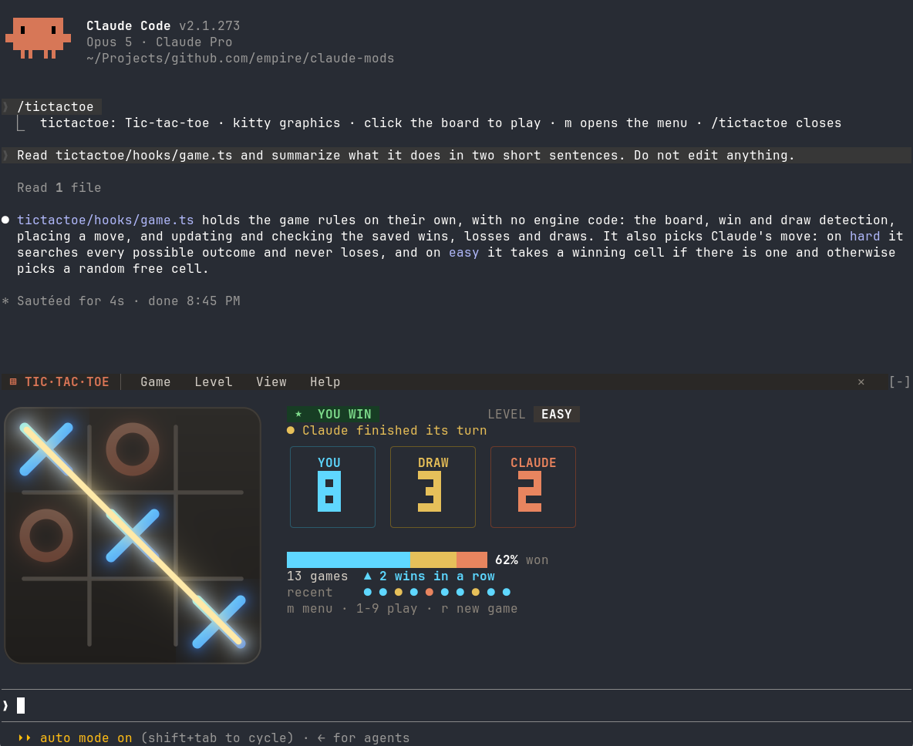
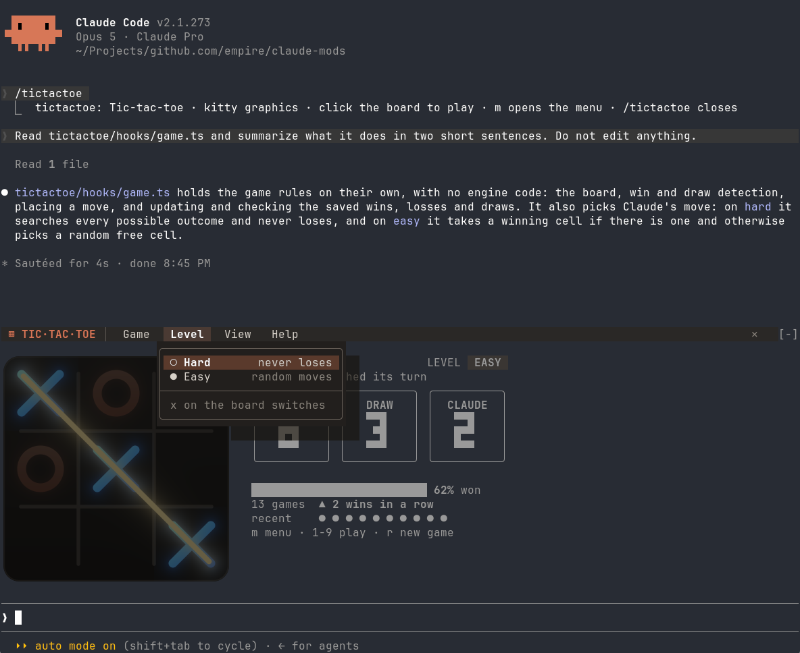

# tictactoe

Tic-tac-toe above the Claude Code prompt, to play while Claude works. You play
✕ against Claude's ◯. It's built entirely as a **Claude Code mod**: a plugin
made of function hooks, with no fork and no patch.



## Features

- **A real image board in Ghostty and kitty.** The board is painted pixel by
  pixel and shown with the kitty graphics protocol: glowing marks that scale
  in, a highlighted cursor cell with a preview ✕, and a line that sweeps
  through a win. In other terminals, including tmux, it switches to a board
  drawn in box-drawing characters.
- **An app-style menu bar.** `Game` has New game, Reset score… and Close
  board, `Level` has Hard and Easy, `View` switches between the image and text
  boards, and `Help` lists the controls. Menus open over the game with a drop
  shadow while the board dims beneath them, and they work with the mouse or
  the keyboard.
- **A scoreboard.** It shows a status pill (your move, Claude thinking, the
  result), a level badge, YOU / DRAW / CLAUDE tallies in large digits, a
  win-rate bar, games played, your current streak and the last ten results.
- **Two levels.** On Hard, Claude plays perfect minimax and never loses. On
  Easy, it plays random moves but still takes a win when it sees one.
- **Stays out of Claude's way.** Commands run right away even mid-turn, the
  board notes when Claude finishes its turn, and playing costs no tokens,
  because the plugin answers every click itself.
- **Remembers you.** The score, result history, level and board choice are
  saved and survive restarts.
- **Fits the space.** When the area above the prompt is short, a compact
  layout takes over.



## Try it

Function hooks are early access, so they only load with this variable set.
Set it for one session:

```sh
CLAUDE_CODE_ENABLE_FUNCTION_HOOKS=1 claude --plugin-dir ./tictactoe
```

or for every session, in `~/.claude/settings.json`:

```json
{ "env": { "CLAUDE_CODE_ENABLE_FUNCTION_HOOKS": "1" } }
```

Requirements:

- Claude Code 2.1.278 or later, in an interactive terminal that reports the
  mouse.
- For the image board: Ghostty or kitty (not inside tmux), and `python3`,
  which reads the terminal's cell size in pixels.

## Play

| Command | What it does |
| --- | --- |
| `/tictactoe` | Opens the board, or closes it if it's open |
| `/tictactoe stop` | Closes the board |
| `/tictactoe text` / `kitty` / `auto` | Always the text board / the image even where the terminal isn't detected / the image where it's supported (default). The choice is saved |

| Input | What it does |
| --- | --- |
| Click a cell | Plays it; the first click also gives the board the keyboard |
| Hover | Moves the highlight |
| `1`–`9` | Plays that cell |
| Arrows or WASD, then Enter or Space | Moves the highlight and plays |
| `r` | Starts a new game |
| `x` | Switches the level |
| `m` | Opens the menu; arrows move, Enter picks, Esc closes |
| Esc | Gives the keyboard back to the prompt |

After a game ends, a click or Enter starts the next one. Resetting the score
asks first, with Cancel selected by default.

## How it's built

| file | role |
| --- | --- |
| `hooks/register.tsx` | Hooks module. Registers `/tictactoe`, mounts the board in `ui.render` of `AbovePrompt`, stores the score, history and settings, carries out menu actions, and draws the image board as an `Image`, swapping in each painted frame |
| `hooks/board.tsx` | Surface module, mounted with `<Client module="./board.tsx">`. Owns the game, the pointer and keys, and composes the whole band body |
| `hooks/ui/screen.tsx` | A cell grid drawn layer over layer and then turned into Text, which is how the menu can cover the board; image cells stay undrawn gaps |
| `hooks/ui/menus.ts` | The menu bar, the dropdowns, and hit-testing for both |
| `hooks/ui/scoreboard.ts` | The scoreboard and its compact version |
| `hooks/ui/text-board.ts` | The box-drawing board |
| `hooks/ui/theme.ts` | The shared palette |
| `hooks/game.ts` | Game rules and Claude's move choice, with no engine calls |
| `hooks/kitty/paint.ts` | Paints a frame as RGBA pixels: antialiased shapes built from distance functions, with gradients and glow |
| `hooks/kitty/terminal.ts` | The python helper that reads the cell size in pixels, and base64 for the image source |

### The image board

Claude Code's `Image` element draws the picture: with the kitty graphics
protocol in kitty and Ghostty, and its `alt` text elsewhere. A surface module
can't draw an `Image`, so the two modules share the job:

1. When the board opens, a python helper reads the terminal's cell size in
   pixels from `/dev/tty`. The image is then sized to match its cell box
   exactly, so pointer positions map straight onto board cells.
2. `register.tsx` draws the band as an `Image`, placed with
   `position: "absolute"` two rows down, followed by the board's `Client`.
   `board.tsx` leaves the board's cells as gaps (empty Boxes), so the picture
   shows through them. An open menu replaces some of those gaps with its text,
   and because it paints after the picture, it covers the picture.
3. Whenever the board's look changes, `board.tsx` posts a `View` (board,
   cursor, animation progress). `register.tsx` paints it as RGBA and swaps it
   into the mounted `Image` with `$.ui.blit`, with no redraw. Blits run one at
   a time, and frames that arrive in the meantime collapse into the latest.
   If the terminal turns out to draw the `alt` in place of the picture, the
   board falls back to text.

### Messages between the modules

- **Hooks module → board:** it passes props (`difficulty`, `score`,
  `history`, `done`, `compact`, `kitty`, `ack`, `columns`).
- **Board → hooks module:** it sends `{ kind: 'sync', view, events }` posts.
  A later post in the same frame replaces an undelivered one, so each post
  carries every event that `ack` hasn't acknowledged yet (`result`,
  `set-difficulty`, `reset-score`, `set-image-board`, `close`).
  `ui.message` applies each event once.

Nothing in the engine's layout can overlap, so the board module draws
everything into one cell grid (`ui/screen.tsx`) and hands the renderer only
the finished rows.

Two rules the loader and validator enforce:

- `$` is only ever used as `$.noun.event(...)`. That includes `$.env.get`,
  which needs a literal variable name. Never store `$` or pass it around.
- `<Client module>` must be a string literal, because the engine reads it
  from the source.

## Check

```sh
npx -p typescript@5 tsc -p tsconfig.json   # from the repo root
claude plugin validate tictactoe
```
